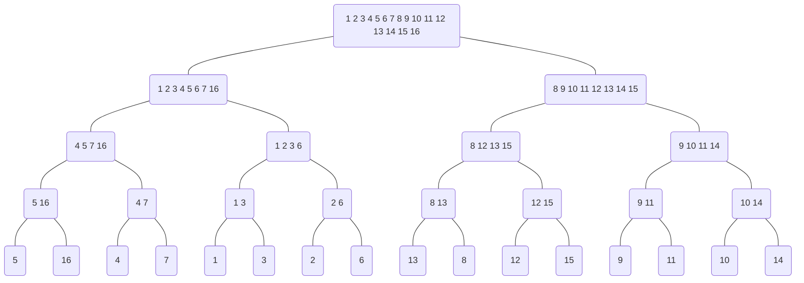

# 第6章 动态规划

## 6.3 保存$f_i[j]$和$l_i[j]$值的表，总大小为$4n-2$，说明如何把表的大小缩减到$2n+2$，使之仍然能够计算出$f^*$，并且仍然能够构造出最快装配路线。

**ANSWER：**

```vb
DPfastestWay(a, t, e, x, n)
    f[1, 1] = e[1] + a[1, 1]; f[2, 1] = e[2] + a[2, 1]
    for j = 2 to n do
        if f[1, 1] + a[1, j] <= f[2, 1] + t[2, j - 1] + a[1, j] then
            f[1, 2] = f[1, 1] + a[1, j]
            l[1, j] = 1
        else
            f[1, 2] = f[2, 1] + t[2, j - 1] + a[1, j]
            l[1, j] = 2
        if f[2, 1] + a[2, j] <= f[1, 1] + t[1, j - 1] + a[2, j] then
            f[2, 2] = f[2, 1] + a[2, j]
            l[2, j] = 2
        else
            f[2, 2] = f[1, 1] + t[1, j - 1] + a[2, j]
            l[1, j] = 1
        f[1, 1] = f[1, 2]
        f[2, 1] = f[2, 2]
    if f[1, 1] + x[1] <= f[2, 1] + x[2] then
        fOut = f[1, 1] + x[1]
        lOut = 1
    else
        fOut = f[2, 1] + x[2]
        lOut = 2
```
## 6.5 给定矩阵连$A_1,A_2,...,A_j,...,A_n$，由$DPMatrixChain$计算出的$s$以及下标$i$和$j$，请设计一个求最优的矩阵链乘法的递归算法$MatrixChainMultiply(A,s,i,j)$。(初始调用为$MatrixChainMultiply(A,s,1,n)$)

**ANSWER：**

```vb
MatrixChainMultiply(A, s, i, j)
    if i = j then
        return A[i]
    else
        B[1] = MatrixChainMultiply(A, s, i, s[i, j])
        B[2] = MatrixChainMultiply(A, s, s[i, j] + 1, j)
        return B[1]*B[2]
```
## 6.7 画出$MergeSort$算法排序16个元素的递归树。请解释在提高一个好的分治算法，例如$MergeSort$的效率时，利用备忘录方法为什么没有效果。

**ANSWER：**

使用$MergeSort$算法排序16个元素，元素序列为(5 ,16 ,4 ,7 ,1 ,3 ,2 ,6 ,13 ,8 ,12 ,15 ,9 ,11 ,10 ,14)。



由上图可以看出每个子问题都是全新的,不存在子问题重叠的情况，故利用备忘录方法没有效果。

## 6.9 已知原始序列$X_m=<x_1,x_2,...,x_m>$和$Y_n=<y_1,y_2,...,y_n>$，假设已计算出表$c$，说明不用表$b$，也可以在$O(m+n)$时间内构造一个$LCS$。